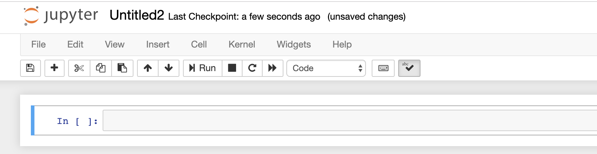

# Setting up a Professional Data Science Environment - Installation

## Introduction


## Objectives

You will be able to:


## Confirming Your Git Installation (All Operating Systems)

To confirm you have installed Git successfully:

1. Open a terminal window

    - On Windows, using the start menu, open the “Git Bash” program to open a terminal window
    - On a Mac, open the “Terminal” app in the “Utilities” folder within your “Applications” folder - or, find the "Terminal" app in your Launchpad 

2. Type `git --version`: It should return the version of git you are running

While you’re in the terminal, you should also set up your name and email address:

1. In your terminal window, type `git config --global user.name`

    - If it returns your name, you’re set! 

2. If it returns nothing or displays an error message, type `git config --global user.name “Your Name”` - replacing Your Name with your name inside the quotes

3. Type `git config --global user.email`

    - If it returns your email address, you’re set! 

4. If it returns nothing or displays an error message, type `git config --global user.email your@email.com` - replacing your@email.com with your email address

## Testing Your Anaconda Installation (All Operating Systems)

To test your installation:

- On Windows, click on Start and then Anaconda Navigator in the program list (or search for Anaconda in the search bar and select Anaconda Navigator)
- On a Mac, open up the finder, and in the Applications folder, double click on Anaconda-Navigator

From now on, screenshots will be from a Mac, but we’ll highlight any material differences in the experience between the operating systems.

The Anaconda Navigator is one of the ways you’ll be able to run Jupyter Notebooks. Click on the “launch” button in the Jupyter notebook tile.


On a Mac, you’ll see a terminal window pop up.


On both Windows and a Mac, you’ll see a window in your web browser that allows you to open existing Jupyter notebooks or create a new one.


Click on the “New” button in the top right corner.


And select “Python 3” from the drop-down list.

When you do, you’ll see a new notebook in your browser window that looks something like this:



To make sure it’s working, click in the cell and type the following:

```
import sys
print(sys.version)
```

Then hold down the shift key and hit return/enter (`shift`+`return`) to run the code in the cell. You should see an output something like this:


Don’t worry if the version number or date is slightly different. If you get a similar output (something that isn’t an error message), congratulations! You’ve got Anaconda, Python and the Jupyter notebook installed successfully!

To shut down Jupyter notebook, just close the tabs in your browser containing the notebook and the list of notebooks. On a Mac, you should also click on the terminal window, hold down the control key and hit C (`control`+`C`) to close the notebook.


You’ll then have to hit “y” and return/enter to confirm that you want to close down Jupyter notebook.


## Summary

Congratulations! If you've gotten this far and everything has worked, you have successfully installed Git and Anaconda on your computer! Next, you'll learn what a virtual environment is - and set one up!
